[README (3).md](https://github.com/user-attachments/files/23567831/README.3.md)
# 🚀🔥 Modern Cloud Deployment :  Incident Reporting System on AWS (Containers + Compute + Database + Alerts + Logs)
##### A complete deployment journey!

##### A secure and scalable Incident Reporting application deployed on AWS using EC2 (Docker container), ECR, and RDS MySQL in private subnets. The setup uses a custom VPC, public/private subnets, IAM, Security Groups, and an Internet Gateway for controlled access. SNS handles alert notifications, while CloudWatch provides logging and monitoring—ensuring reliable, safe, and efficient operations.
# 
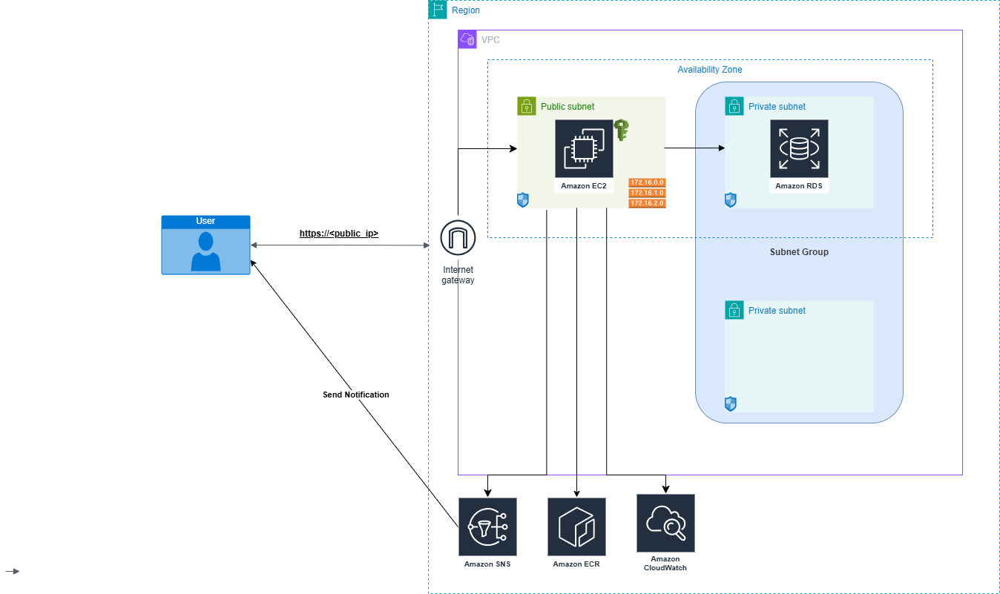
---

## 🔶 Steps to Create a VPC (Using AWS Console) -
#### 1️⃣ Go to the VPC Dashboard

Click Create VPC
***
#### 2️⃣ VPC Settings (Choose These Options)
Resources to create

 - Select VPC and more

Name tag auto-generation

- Select: Auto-generate

- Enter Name: project

IPv4 CIDR block

- Enter: 10.0.0.0/16

IPv6 CIDR block

- Select: No IPv6 CIDR block

Tenancy

- Select: Default

Number of Availability Zones

- Choose: 2 AZs (Recommended by AWS for high availability)

Number of Public Subnets

- Select: 2

Number of Private Subnets

- Select: 2

Customize subnet CIDR blocks

(You can leave default OR choose these example CIDRs):
```
| Subnet Type | AZ   | CIDR          |
|-------------|------|---------------|
| Public 1    | AZ-a | 10.0.1.0/24   |
| Public 2    | AZ-b | 10.0.2.0/24   |
| Private 1   | AZ-a | 10.0.3.0/24   |
| Private 2   | AZ-b | 10.0.4.0/24   |
```
NAT Gateways ($)

- Choose : None

 VPC Endpoints

- Choose : S3 Gateway (recommended to reduce NAT cost)

DNS Options

Make sure both are enabled:

-  Enable DNS hostnames
-  Enable DNS resolution

Click Create VPC

- AWS will automatically create:

    VPC

    2 public subnets

    2 private subnets

    IGW

    NAT Gateway

    Route tables

    Endpoint (S3)

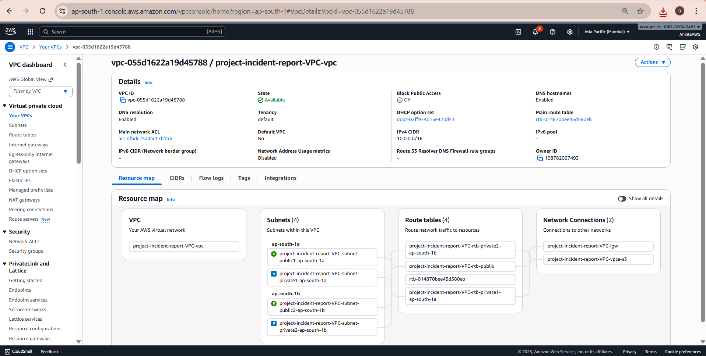

═══════════════════════════════════════════════════════════════


## 🔐 Steps to Create Security Groups in AWS
#### 1️⃣ Create Security Group for EC2 -
Step 1: Open AWS Console

- Go to VPC Console → Security Groups → Create Security Group.

Step 2: Enter Basic Details

- Security group name: ec2-sg

- Description: SG for EC2 instance

- VPC: Select your project VPC

Step 3: Add Inbound Rules

- Click Add rule and add the following:
```
| Type       | Port | Source   | Purpose     |
| ---------- | ---- | -------- | ----------- |
| SSH        | 22   | My IP    | SSH login   |
| HTTP       | 80   | Anywhere | Web traffic |
| HTTPS      | 443  | Anywhere | Secure web  |
| Custom TCP | 3000 | Anywhere | Node.js app |
```

Step 4: Add Outbound Rule

- Leave as default (All traffic allowed).

Step 5: Create

- Click Create security group.
***
#### 2️⃣ Create Security Group for RDS -
Step 1: Go to VPC → Security Groups → Create

- Click Create Security Group

Step 2: Basic Details

- Security group name: rds-sg

- Description: SG for MySQL RDS

- VPC: Select the same VPC as EC2

Step 3: Add Inbound Rule

- Allow MySQL access only from EC2 SG (recommended for security).
```
| Type         | Port | Source    | Purpose                   |
| ------------ | ---- | --------- | ------------------------- |
| MySQL/Aurora | 3306 | EC2-SG ID | Allow EC2 to access MySQL |
```

Step 4: Outbound Rule

- Leave default (all outbound allowed)

Step 5: Create

- Click Create security group

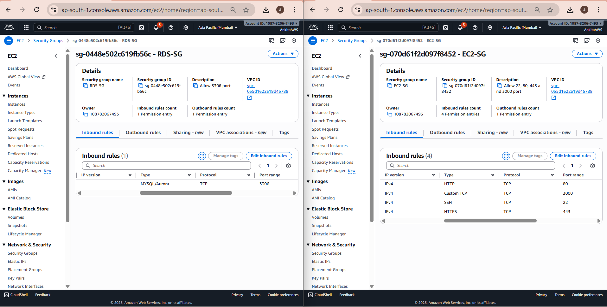
═══════════════════════════════════════════════════════════════

## 🟧 🗄️ Create an RDS MySQL Database -
#### 1️⃣ Open Amazon RDS

Go to the AWS Management Console

In the search bar, type RDS

Click Amazon RDS
***
#### 2️⃣ Create a New Database

On the left menu, click Databases

Click Create database
***
#### 3️⃣ Select a Database Creation Method

Choose:

✔️ Standard Create

This gives you full configuration control.
***
#### 4️⃣ Choose Database Engine

Select : MySQL

Then choose version (recommended: latest MySQL 8.x).
***
#### 5️⃣ Choose Database Template

Select one:
- Free tier (if eligible)

- Dev/Test

- Production

👉 Free tier is best for beginners.
***
#### 6️⃣ Configure DB Instance

Fill the required fields:

🏷️ DB Instance Identifier-

- Example : incidentdb
👤 Master Username-

- Example : admin

🔒 Master Password-

- Enter your password.
***
#### 7️⃣ Choose Instance Size

- Choose instance type (for free tier) : db.t3.micro
***
#### 8️⃣ Storage Settings

- Choose General Purpose (gp3)

- Allocate storage (20GB default is fine)

- Disable “Storage autoscaling” for simple testing
***
#### 9️⃣ Connectivity (Important)
- VPC - Choose your default VPC or custom VPC.

- Public access → Yes

- VPC Security Group - Choose an existing SG (rds-sg).

This allows EC2 to connect to your RDS.
***
#### 🔟 Create Database

- Scroll down and click : Create database

AWS will now launch your MySQL RDS instance (takes 2–5 min).
***
#### 1️⃣1️⃣ Get the RDS Endpoint

After the DB status becomes Available:

- Click your database

- Scroll to Connectivity & security

- Copy the Endpoint, for example:

  incidentdb.xxxxxxx.ap-south-1.rds.amazonaws.com


You'll use this in your .env:
``` bash
DB_HOST=<your-rds-endpoint>
DB_USER=<your-username>
DB_PASSWORD=<your-password>
DB_NAME=incidentdb
```

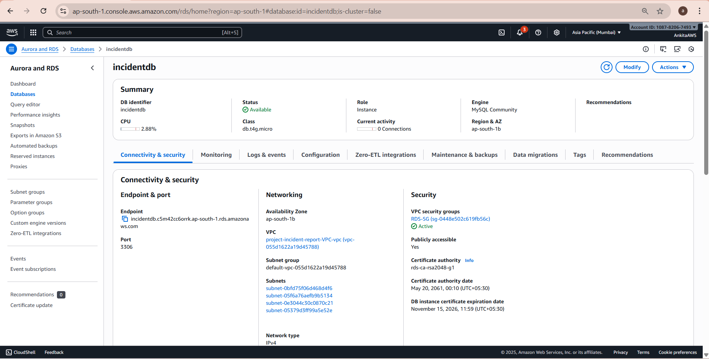

═══════════════════════════════════════════════════════════════
## 🟦 💻 Create an EC2 Instance -
#### 1️⃣ Open the EC2 Dashboard

- Go to the AWS Management Console

- Search for EC2

- Click EC2 Dashboard
***
#### 2️⃣ Launch a New Instance

- Click Instances on the left panel

- Click Launch instances
***
#### 3️⃣ Name Your Instance

- Enter a descriptive name like : incident-reporting-server
***
#### 4️⃣ Choose an Amazon Machine Image (AMI)

Select an OS:

- ✔️ Amazon Linux 2023 (recommended)
  or
- ✔️ Ubuntu 22.04 LTS

These are best for Node.js + Docker setups.
***
#### 5️⃣ Choose Instance Type

For simple apps/testing:

- t2.micro (Free Tier Eligible)

For production:

- t3.small or t3.medium
***
#### 6️⃣ Create or Select a Key Pair

This key allows you to SSH into the instance.

- Click Create new key pair

- Key pair type: RSA

- Save the .pem file securely
(You cannot download it again!)
***
#### 7️⃣ Configure Network Settings

Click Edit under Network settings:

✔️ VPC
- Choose your default VPC or custom VPC.

✔️ Subnet

- Choose a public subnet.

✔️ Auto-assign Public IP

- Select : Enable

✔️ Firewall (Security Group)

- Choose Create new security group.
- Add inbound rules:
```
| Type        | Port | Source   | Purpose        |
|-------------|------|----------|----------------|
| SSH         | 22   | My IP    | SSH login      |
| HTTP        | 80   | Anywhere | Web traffic    |
| HTTPS       | 443  | Anywhere | Secure web     |
| Custom TCP  | 3000 | Anywhere | Node.js app    |

```
👉 If you will pull images from ECR, make sure the EC2 role has ECR access.
***
#### 8️⃣ Configure Storage

- Default is enough : 30GB gp3
***
#### 9️⃣ Launch Instance

- Click:

  ➡️ Launch Instance

Your EC2 instance will start in 1–2 minutes.

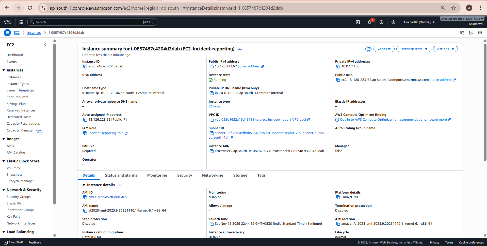

═══════════════════════════════════════════════════════════════

## 🔐Create IAM Role for EC2 (With Required Permissions)

This role allows your EC2 instance to access ECR, RDS, SNS, CloudWatch Logs, Secrets Manager, and SSM.

#### 1️⃣ Go to IAM Console

- Open AWS Console

- Search for IAM

- Click Roles from the left sidebar

- Click Create role
***
#### 2️⃣ Select Trusted Entity

- Under Trusted entity type, choose:

  ➡️ AWS Service

- Under Use case, select:

  ➡️ EC2
- Then click Next
***
#### 3️⃣ Attach Permissions Policies

Since you are using a custom inline policy, skip AWS-managed policies.

Scroll down and Click Next (no managed policies selected)
***
#### 4️⃣ Add Inline Policy

On the Review page, find Add permissions

- Select:

  ➡️ Create inline policy

- Switch to JSON tab

- Paste your policy:
```json

{
    "Version": "2012-10-17",
    "Statement": [
        {
            "Sid": "ECRPermissions",
            "Effect": "Allow",
            "Action": [
                "ecr:GetAuthorizationToken",
                "ecr:BatchCheckLayerAvailability",
                "ecr:GetDownloadUrlForLayer",
                "ecr:BatchGetImage"
            ],
            "Resource": "*"
        },
        {
            "Sid": "RDSPermissions",
            "Effect": "Allow",
            "Action": [
                "rds:DescribeDBInstances",
                "rds:DescribeDBClusters",
                "rds:ListTagsForResource"
            ],
            "Resource": "*"
        },
        {
            "Sid": "SNSPermissions",
            "Effect": "Allow",
            "Action": [
                "sns:Publish",
                "sns:GetTopicAttributes",
                "sns:ListTopics"
            ],
            "Resource": "*"
        },
        {
            "Sid": "CloudWatchLogsPermissions",
            "Effect": "Allow",
            "Action": [
                "logs:DescribeLogGroups",
                "logs:DescribeLogStreams",
                "logs:CreateLogGroup",
                "logs:CreateLogStream",
                "logs:PutLogEvents"
            ],
            "Resource": "*"
        },
        {
            "Sid": "SecretsManagerPermissions",
            "Effect": "Allow",
            "Action": [
                "secretsmanager:DescribeSecret",
                "secretsmanager:GetSecretValue"
            ],
            "Resource": "*"
        },
        {
            "Sid": "SSMPermissions",
            "Effect": "Allow",
            "Action": [
                "ssm:DescribeInstanceInformation",
                "ssm:GetCommandInvocation",
                "ssm:SendCommand"
            ],
            "Resource": "*"
        }
    ]
}

```
- Click Review Policy

- Give it a name:

  ➡️ EC2-FullAppPermissions-Policy

- Click Create Policy
***
#### 5️⃣ Name & Create Role

- Enter a role name:

  ➡️ EC2-App-Execution-Role

- Add a description (optional) : Role for EC2 instance to access ECR, RDS, SNS, CloudWatch Logs, Secrets Manager, and SSM.

- Click Create role
***
#### 6️⃣ Attach Role to EC2

After the role is created:

- Open EC2 Dashboard

- Select your instance

- Click Actions → Security → Modify IAM role

- Select:

  ➡️ EC2-App-Execution-Role

- Click Update IAM role

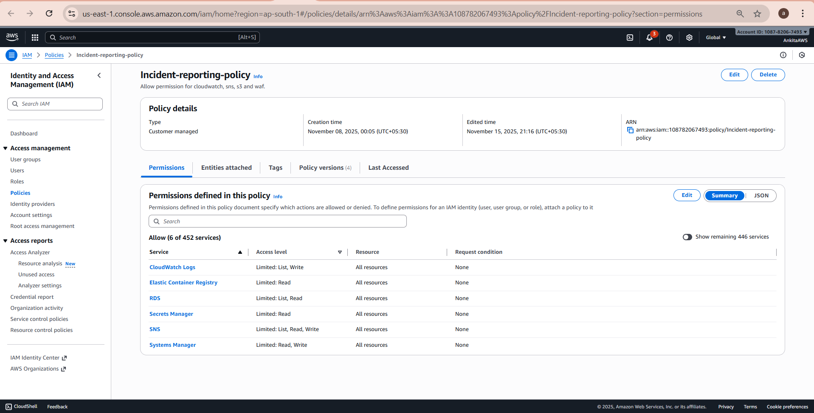
═══════════════════════════════════════════════════════════════

## 🟧 📢 Create SNS for Notifications (Step-by-Step) -
#### 1️⃣ Open SNS Service

- Go to AWS Management Console

- In the search bar, type SNS

- Click Simple Notification Service
***
#### 2️⃣ Create a New Topic

- On the left side, click Topics

- Click Create topic
***
#### 3️⃣ Choose Topic Type

You will see two options:

- Standard (recommended)

- FIFO

Choose Standard.
***
#### 4️⃣ Enter Topic Name

Example : incident-alerts

AWS will generate the Topic ARN automatically:

- 'arn:aws:sns:<region>:<account-id>:incident-alerts '
***
#### 5️⃣ Configure Additional Settings (Optional)
##### 🔐 Encryption

- Leave default unless you use KMS.

##### 📜 Access Policy

- Default is fine unless allowing cross-account access.

##### 🕒 Delivery Retries

- Keep default values.

***
#### 6️⃣ Create the Topic

- Click Create topic

Your SNS topic is now ready!
***
#### 7️⃣📩  Create an Email Subscription

Go to your newly created topic

- Click Create subscription

- Set Protocol → Email

- Set Endpoint → your email address

- Click Create subscription

You will get a confirmation email → click Confirm subscription.

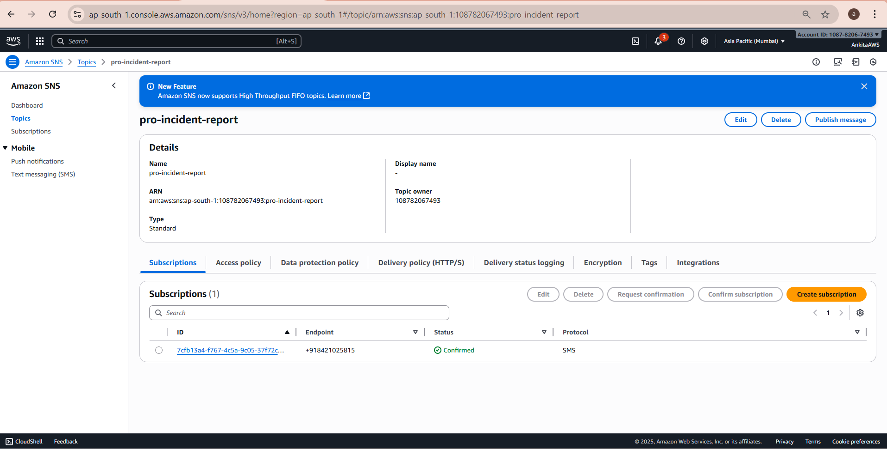


═══════════════════════════════════════════════════════════════

## 🐳 Create an Amazon ECR Repository (for Docker Images)

Follow these steps to create an Elastic Container Registry (ECR) repo for your Docker images.

#### 1️⃣ Open ECR Console

- Go to AWS Management Console

- Search for “ECR” (Elastic Container Registry)

- Click Amazon ECR
***
#### 2️⃣ Select Repository Type

You will see two options:

- Private (recommended — secured)

- Public

Choose:

- ➡️ Private
***
#### 3️⃣ Click “Create repository”

- This opens the repository creation screen.
***
#### 4️⃣ Configure Repository Settings

Fill the fields:

- 🔤 Repository name

   Enter your repo name, 
   e.g. : incident-reporting-repo
***
#### 5️⃣ Configure Optional Settings

You can leave defaults, but here's what each option means:

🔹 Tag immutability - When ON, prevents overwriting tags (safer)


🔹 Scan on push - Automatically scans uploaded images for vulnerabilities

🔹 Encryption - Default AWS-managed encryption is fine

🔹 KMS key - Not required unless using custom encryption

***
#### 6️⃣ Click Create Repository

Your ECR repo is now created 🎉

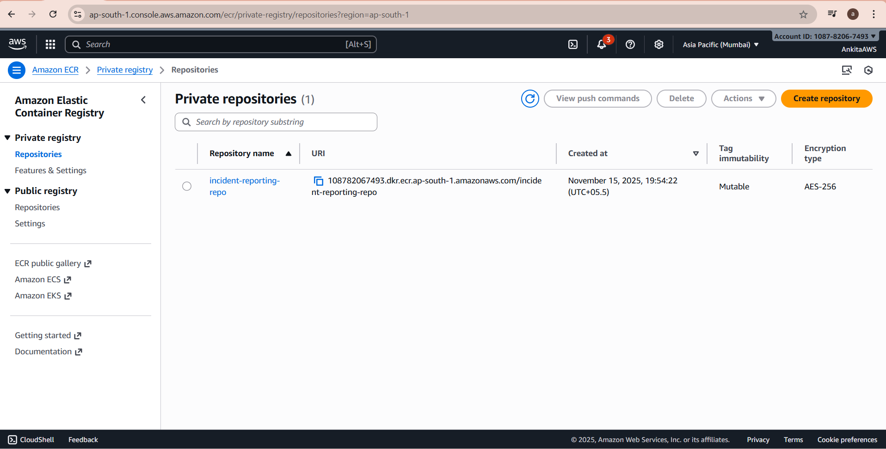
***


═══════════════════════════════════════════════════════════════

## 🟦 📊 Create CloudWatch Log Group & Log Stream -
#### 1️⃣ Open CloudWatch Service

- Go to AWS Console

- In the search bar, type CloudWatch

- Click CloudWatch
***

#### 2️⃣ Create a Log Group

- On the left sidebar, click Logs → Log groups

- Click Create log group

- Enter a name:

  Example : incident-reporting-logs

Click Create
***
#### 3️⃣ Create a Log Stream

- Open the log group you just created

- Click Create log stream

- Enter a stream name:

  Example : incident-reporting-log-stream

Click Create

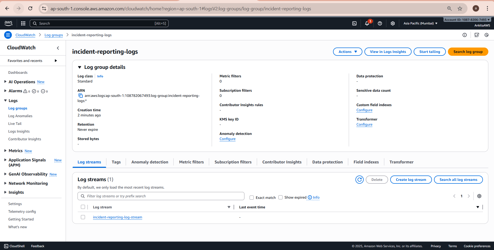


═══════════════════════════════════════════════════════════════

## 🧩Build and Push Image to ECR

#### 1️⃣🔧Configure AWS-

Opens AWS CLI :

```bash
  aws configure
```
Enter your AWS Access Key ID, Secret Access Key, Region (e.g., ap-south-1), and output format (json). 

- AWS Access Key ID [****************CCH2]:

- AWS Secret Access Key [****************Sbpp]:

- Default region name [ap-south-1]:

- Default output format [None]:

This authenticates your local machine with AWS.

***
#### 2️⃣🟦 Install Git -
If Git is already installed, you can skip these steps.

```bash
winget install Git.Git
```
Installs Git so you can clone your project repository.
***
#### 3️⃣🐳 Install Docker -
If Docker is already installed, you can skip these steps.
```bash
winget install Docker.DockerDesktop
```
Installs Docker Desktop to build and run containers locally.
***
#### 4️⃣📥 Clone Your Repository -
```bash
git clone <repository-url>
```
This command makes a local copy of a remote GitHub repository onto your machine.

Replace <repository-url> with the HTTPS or SSH link of your repo.

``` bash
cd <repository-folder>
```
This command moves you into the newly created folder that contains all the project files.

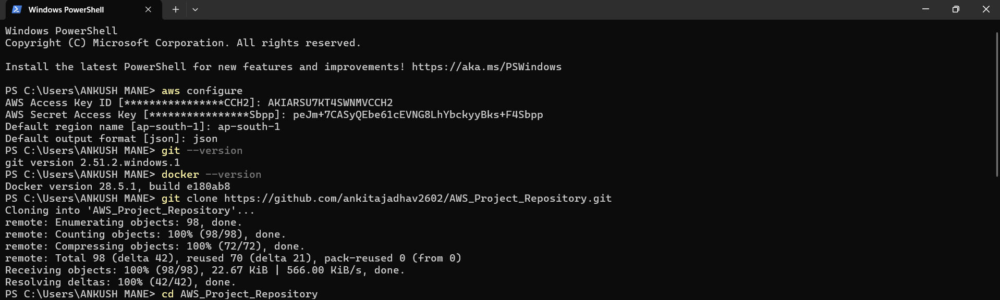

#### 5️⃣🔐 Authenticate Docker to ECR -
``` bash
aws ecr get-login-password --region <region> \
  | docker login --username AWS --password-stdin <aws_account_id>.dkr.ecr.<region>.amazonaws.com
  ```
Retrieves a temporary token and logs Docker into your ECR registry.

Replace <region> with your AWS region (e.g., ap-south-1).

Replace <aws_account_id> with your AWS account ID.

***
#### 6️⃣🏗️ Build Docker Image -
```bash
docker build -t <image-name> .
````
Builds an image from your Dockerfile.

Replace <image-name> with a name for your app (e.g., incident-reporting-app).

***
#### 7️⃣🏷️ Tag Image for ECR -
```bash
docker tag <image-name>:latest <aws_account_id>.dkr.ecr.<region>.amazonaws.com/<repository-name>:latest
```
Prepares the image with the correct ECR repository URI.

Replace <repository-name> with the name of your ECR repository.
***
#### 8️⃣📤 Push Image to ECR-
```bash
docker push <aws_account_id>.dkr.ecr.<region>.amazonaws.com/<repository-name>:latest
```
Uploads the image to ECR so EC2 can pull it later.


═══════════════════════════════════════════════════════════════

## 🚀 EC2 Setup: SSH, Install Git, Docker & MySQL
#### 1️⃣🔐 SSH Into EC2 Instance -
``` bash
ssh -i your-key.pem ec2-user@<EC2-Public-IP>
```
ssh -i your-key.pem → uses your private key to authenticate.

ec2-user@<EC2-Public-IP> → connects to your EC2 instance.
***
#### 2️⃣📂 Install Git -
``` bash
sudo yum install git -y
```
Installs Git on Amazon Linux.
***
#### 3️⃣🐳 Install Docker
```bash
sudo yum update -y
sudo yum install docker -y
sudo service docker start
sudo usermod -a -G docker ec2-user
```
yum update -y → updates package lists.

yum install docker -y → installs Docker engine.

service docker start → starts Docker service.

usermod -a -G docker ec2-user → adds your user to Docker group (so you can run Docker without sudo).


#### 4️⃣🛢 Install MySQL Client 
Download MySQL Yum Repository
```bash
sudo wget https://dev.mysql.com/get/mysql80-community-release-el9-1.noarch.rpm
```
***
#### 📦 Downloads the repository package for MySQL.
Install the Repository Package
``` bash
sudo dnf install -y mysql80-community-release-el9-1.noarch.rpm
```
***
#### 🔑 Registers MySQL repo with your system.
Import the MySQL GPG Key
```bash
sudo rpm --import https://repo.mysql.com/RPM-GPG-KEY-mysql-2023
```
***
#### 📥 Ensures package authenticity.
Install the MySQL Client
```bash
sudo dnf install -y mysql-community-client
```
***
#### 🧪 Installs MySQL client tools.
Verify Installation
```bash
mysql --version
```
✅ Confirms MySQL client is installed.


## 5️⃣🗄️ MySQL Setup: Create DB, Table, Exit
#### 🔑 Connect to RDS
```bash
mysql -h <your-rds-endpoint> -u <your-username> -p
```
Replace <your-rds-endpoint> → your RDS MySQL endpoint
 and <your-username> → your RDS username
***
#### 📂 Create Database
```sql
CREATE DATABASE incidentdb;
USE incidentdb;
```
Creates a new database named incidentdb.
***
#### 🗂 Create Table
```sql
CREATE TABLE incidents (
  id INT AUTO_INCREMENT PRIMARY KEY,
  name VARCHAR(255) NOT NULL,
  description TEXT NOT NULL,
  severity VARCHAR(50) NOT NULL,
  reported_at TIMESTAMP DEFAULT CURRENT_TIMESTAMP
);

```
id → unique auto‑incrementing identifier.

description → stores incident details.

created_at → automatically records timestamp.
***
#### 🚪 Exit MySQL
```sql
exit;
```
Closes MySQL session.

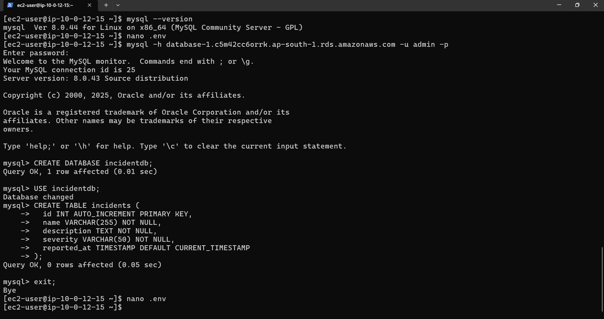

## 6️⃣🌐 Environment File Setup (.env on EC2) -
#### 📝 Create a .env File on Your EC2 Instance

```bash
nano .env
```
***
#### ✍️ Add the Required Variables

Paste the following inside the file:
```bash
PORT=3000
DB_HOST=<your-rds-endpoint>
DB_USER=<your-db-username>
DB_PASSWORD=<your-db-password>
DB_NAME=<your-DB-name>

AWS_REGION=<Your-region>
SNS_TOPIC_ARN=<your-sns-topic-arn>
LOG_GROUP_NAME=<your-cloudwatch-log-group-name>
LOG_STREAM_NAME=<your-cloudwatch-log-group-stream-name>
```
***
#### 💾 Save & Exit

Press CTRL + O → Save

Press Enter → Confirm

Press CTRL + X → Exit editor

Your .env file is now created and ready to be used by Docker.

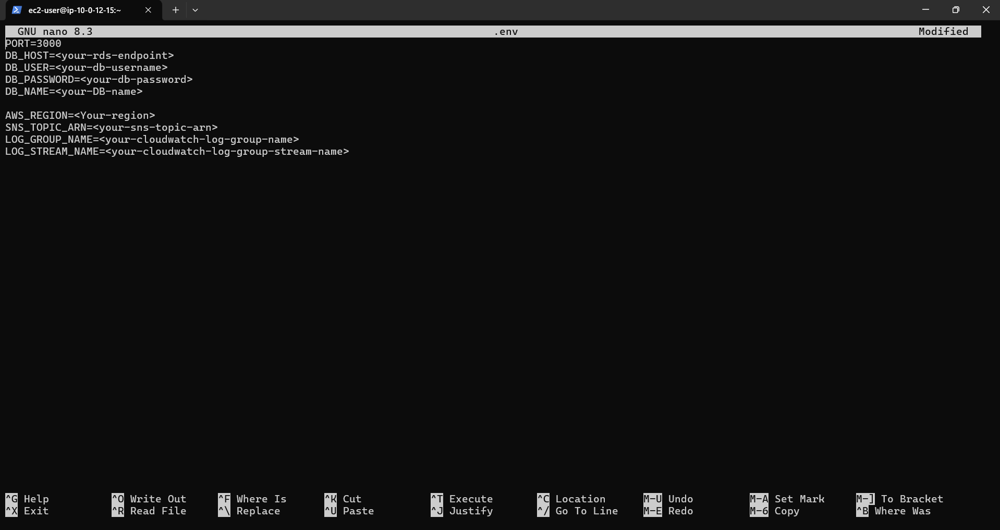

## 7️⃣🐳 Pull & Run Docker Image from ECR -
#### 🔐 Authenticate Docker to ECR (Inside EC2)
``` bash
aws ecr get-login-password --region <region> \
  | docker login --username AWS --password-stdin <aws_account_id>.dkr.ecr.<region>.amazonaws.com
```

Retrieves temporary ECR authentication token

Logs your EC2 Docker engine into Amazon ECR
***
#### 📥 Pull Your Image from ECR
```bash
docker pull <aws_account_id>.dkr.ecr.<region>.amazonaws.com/<repository-name>:latest
```

Downloads the Docker image you built and pushed earlier.
***
#### ▶️ Run Your Container with Environment Variables
``` bash
docker run -d -p 3000:3000 --env-file .env --name incident-app \
  <aws_account_id>.dkr.ecr.<region>.amazonaws.com/<repository-name>:latest
```
What this command does?

- d → Runs container in background

- p 3000:3000 → Maps EC2 port 3000 → container port 3000

- -env-file .env → Loads environment variables from .env file

- -name incident-app → Names the container for easy management

Image URI → Pulls and runs your app from ECR

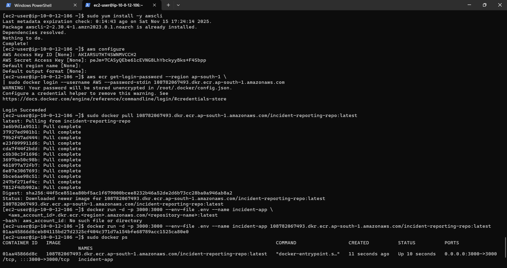

## 8️⃣🧪 Test Your Application
#### 🌍 Open Your Browser:
http://<EC2-Public-IP>:3000


Replace <EC2-Public-IP> with your instance’s public IP address.
***
#### 🔒 Make Sure:

Your EC2 security group allows inbound traffic on port 3000

Docker container is running:
```bash
docker ps
```
═══════════════════════════════════════════════════════════════

## ✅ Final Output Verification
Results of the full setup.

#### 1️⃣📝 Incident Form (Frontend Output)

When your application is running at:

http://<EC2-Public-IP>:3000


You should see the Incident Reporting Form:
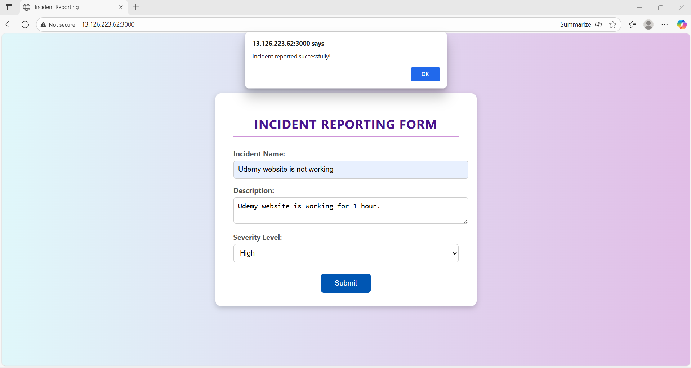
✔ User enters an incident description

✔ Form sends POST request to backend

✔ Backend triggers SNS + stores in RDS + logs to CloudWatch

#### 2️⃣📩 SNS Notification (Email Output)

When an incident is submitted, your subscribed Phone Number receives notification:
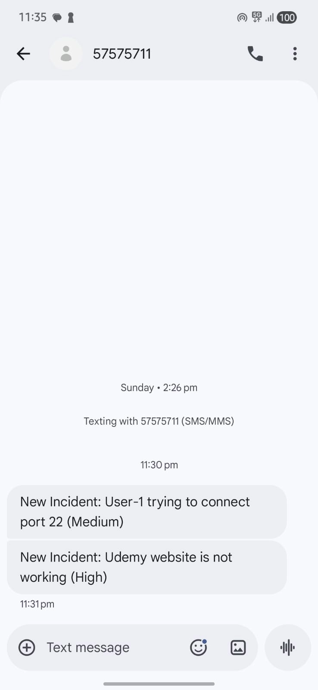

#### 3️⃣📊 CloudWatch Logs (Log Output)

In AWS Console → CloudWatch → Log Groups → incident-reporting-logs → Streams

Each incident generates a log:
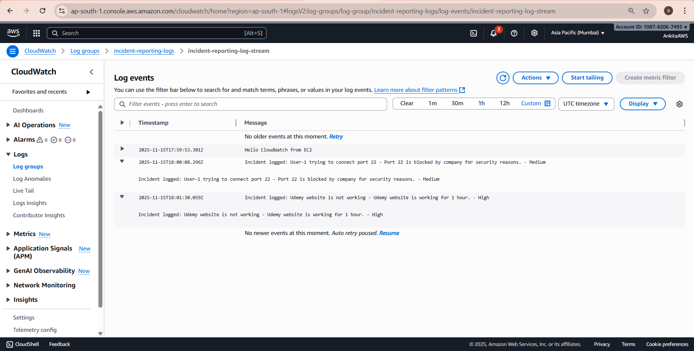

#### 4️⃣🗄️ RDS Database Entry (MySQL Output)

Login to MySQL:
```bash
mysql -h <RDS-ENDPOINT> -u <USER> -p
```
```sql
USE incidentdb;
SELECT * FROM incidents;
```
You should see an entry:
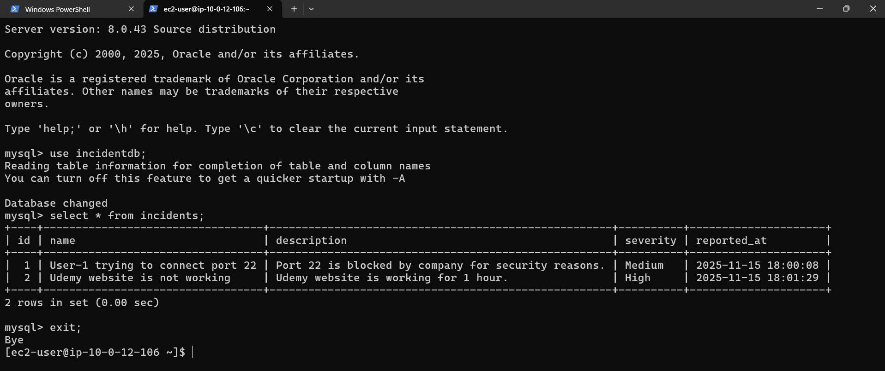

#### 🎉 FINAL RESULT

After completing everything, your system will:

✅ Accept incidents via form

✅ Send real-time SNS alerts

✅ Store incidents in RDS MySQL

✅ Generate CloudWatch logs for monitoring

